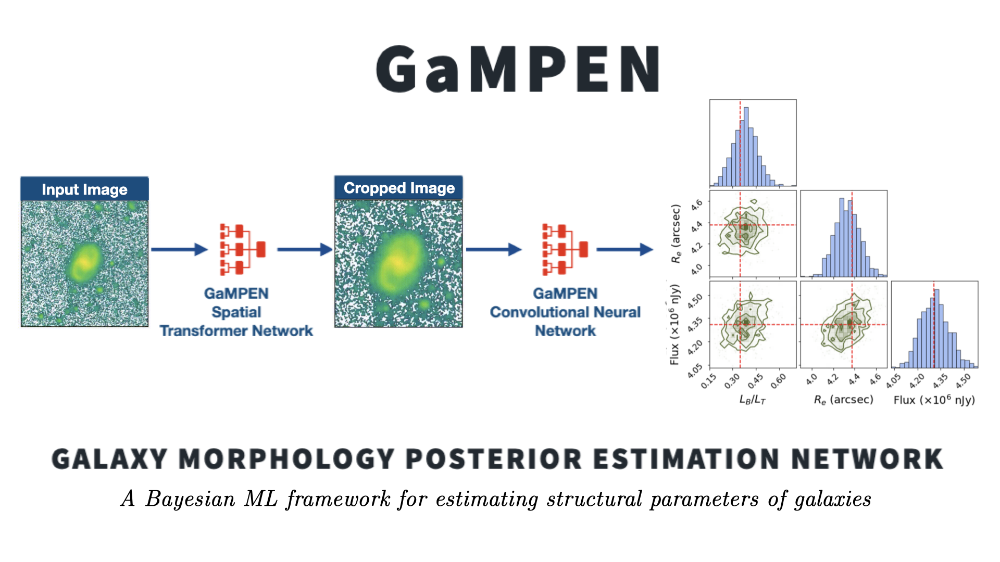

[](https://github.com/aritraghsh09/GaMPEN/actions/workflows/main.yml)
[](https://gampen.readthedocs.io/en/latest/?badge=latest)
[](https://www.python.org/downloads/)
[](https://github.com/aritraghsh09/GaMPEN/blob/master/LICENSE)
[](https://github.com/psf/black)
[](https://zenodo.org/badge/latestdoi/299731956)
[](https://doi.org/10.3847/1538-4357/ac7f9e)
[](https://arxiv.org/abs/2207.05107)

<hr>



<hr>

The Galaxy Morphology Posterior Estimation Network (GaMPEN) is a novel
machine learning framework for estimating the Bayesian posteriors (i.e.,
values + uncertainties) of morphological parameters for arbitrarily
large numbers of galaxies. GaMPEN also automatically crops input galaxy
images to an optimal size before morphological parameter estimation.

GaMPEN's predicted uncertainties have been shown to be upto ~60%
more accurate compared to traditional light-profile fitting codes. GaMPEN 
can be adapted to work on both ground and space-based imaging;
and to predict both parametric and non-parametric estimates of
morphology.

Once trained, it takes GaMPEN less than a milli-second to perform a
single model evaluation on a CPU. Thus, GaMPEN's posterior prediction
capabilities are ready for large galaxy samples expected from upcoming
large imaging surveys, such as Rubin-LSST, Euclid, and NGRST.

**For a quick read-through of why GaMPEN was developed, what challenges
it addresses, and how it works** see this
[link](https://gampen.readthedocs.io/en/latest/About_Gampen.html)

# Documentation

GaMPEN's documentation is available in this repository and also hosted 
on [readthedocs.io](https://gampen.readthedocs.io/) . Although the documentation
is fairly complete; if you are trying to use  GaMPEN and run into issues, 
please get in touch with us!

# Morphology Catalogs
There are multiple structural parameter catalogs that have been created using 
GaMPEN. We maintain an updated list on [this page](https://gampen.readthedocs.io/en/latest/Public_data.html).


# Publications
GaMPEN was initially introduced in the following publication. Please cite this publication if you make use of GaMPEN or some code herein.

``` tex
@article{Ghosh2022,
author = {Aritra Ghosh and C. Megan Urry and Amrit Rau and Laurence Perreault-Levasseur and Miles Cranmer and Kevin Schawinski and Dominic Stark and Chuan Tian and Ryan Ofman and Tonima Tasnim Ananna and Connor Auge and Nico Cappelluti and David B. Sanders and Ezequiel Treister},
doi = {10.3847/1538-4357/ac7f9e},
issn = {0004-637X},
issue = {2},
journal = {The Astrophysical Journal},
month = {8},
pages = {138},
title = {GaMPEN: A Machine-learning Framework for Estimating Bayesian Posteriors of Galaxy Morphological Parameters},
volume = {935},
year = {2022},
}
```
Additionally, if you are using publicly-released GaMPEN models or catalogs for a specific survey, please cite the relevant publication(s) outlined on [this page](https://gampen.readthedocs.io/en/latest/Public_data.html).


# License

Copyright 2022 Aritra Ghosh, Amrit Rau & contributors

Made available under a [GNU GPL
v3.0](https://github.com/aritraghsh09/GaMPEN/blob/master/LICENSE)
license.

# Contributors

GaMPEN was initially developed by [Amrit Rau](https://amritrau.xyz/) and
[Aritra Ghosh](http://www.ghosharitra.com/)

The initial documentation was developed by [Aayush
Mishra](https://github.com/aayush2505) and [Aritra
Ghosh](http://www.ghosharitra.com/)

For an updated list of all current contributors, please see
[here](https://github.com/aritraghsh09/GaMPEN/graphs/contributors)

# Getting Help/Contributing

If you have a question, please send me an e-mail at this
`aritraghsh09@xxxxx.com` GMail address.

If you have spotted a bug in the code/documentation or you want to
propose a new feature, please feel free to open an issue/a pull request
on GitHub.
