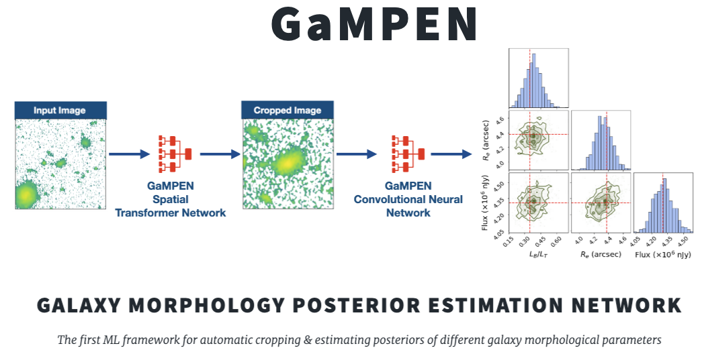

.. image:: https://github.com/aritraghsh09/GaMPEN/actions/workflows/main.yml/badge.svg
    :target: https://github.com/aritraghsh09/GaMPEN/actions/workflows/main.yml
    :alt: Status of Build and Tests Workflow

.. image:: https://readthedocs.org/projects/gampen/badge/?version=latest
    :target: https://gampen.readthedocs.io/en/latest/?badge=latest
    :alt: Documentation Status
    
.. image:: https://img.shields.io/badge/Python-3.7%2B-blue
   :alt: Python Version 3.7 and above 
   :target: https://www.python.org/downloads/

.. image:: https://img.shields.io/github/license/aritraghsh09/GaMPEN
   :alt: GitHub license
   :target: https://github.com/aritraghsh09/GaMPEN/blob/master/LICENSE

.. image:: https://img.shields.io/badge/code%20style-black-000000.svg
   :target: https://github.com/psf/black

.. image:: https://zenodo.org/badge/299731956.svg
   :target: https://zenodo.org/badge/latestdoi/299731956
   :alt: Code DOI
    
.. image:: https://img.shields.io/badge/publication%20doi-10.3847%2F1538--4357%2Fac7f9e-blue
    :target: https://doi.org/10.3847/1538-4357/ac7f9e
    :alt: Publication DOI
    
.. image:: https://img.shields.io/badge/arXiv-2207.05107-blue
    :target: https://arxiv.org/abs/2207.05107
    :alt: arXiv
    
.. raw:: html

   

    

.. raw:: html

   

The Galaxy Morphology Posterior Estimation Network (GaMPEN) is a novel machine learning framework for estimating the Bayesian posteriors (i.e., values + uncertainties) of morphological parameters for arbitrarily large numbers of galaxies. GaMPEN also automatically crops input galaxy images to an optimal size before morphological parameter estimation. 

GaMPEN can be adapted to work on both ground and space-based imaging; and to predict both parametric and non-parametric estimates of morphology. 

Once trained, it takes GaMPEN less than a milli-second to perform a single model evaluation on a CPU. Thus, GaMPEN's posterior prediction capabilities are ready for large galaxy samples expected from upcoming large imaging surveys, such as Rubin-LSST, Euclid, and NGRST. 

**For a quick read-through of why GaMPEN was developed, what challenges it addresses, and how it works** see this `link <http://www.astro.yale.edu/aghosh/gampen.html>`_

Documentation
-------------
We are actively developing extensive documentation and tutorials for GaMPEN. You can find the current state of our documentation and tutorials at `this link <https://gampen.readthedocs.io/>`_ . We hope to have this fully completed by early Spring 2023. If you are trying to use GaMPEN before that and run into issues, please get in touch! 

Publication 
------------
GaMPEN was initially introduced in this `ApJ paper <https://iopscience.iop.org/article/10.3847/1538-4357/ac7f9e>`_ 

An updated record of GaMPEN's trained models and catalogs produced are maintained `here <http://gampen.ghosharitra.com/>`_

Attribution Info.
------------
Please cite the above mentioned publication if you make use of this software module or some code herein.

.. code-block:: tex

    @article{Ghosh2022,
   author = {Aritra Ghosh and C. Megan Urry and Amrit Rau and Laurence Perreault-Levasseur and Miles Cranmer and Kevin Schawinski and Dominic Stark and Chuan Tian and Ryan Ofman and Tonima Tasnim Ananna and Connor Auge and Nico Cappelluti and David B. Sanders and Ezequiel Treister},
   doi = {10.3847/1538-4357/ac7f9e},
   issn = {0004-637X},
   issue = {2},
   journal = {The Astrophysical Journal},
   month = {8},
   pages = {138},
   title = {GaMPEN: A Machine-learning Framework for Estimating Bayesian Posteriors of Galaxy Morphological Parameters},
   volume = {935},
   year = {2022},
   }

Additionally, if you want, please include the following text in the Software/Acknowledgment section.

.. code-block:: tex

    This work uses trained models/software made available as a part of the Galaxy Morphology Posterior Estimation Network public data release. 

License
------------
Copyright 2022 Aritra Ghosh, Amrit Rau & contributors

Made available under a `GNU GPL v3.0 <https://github.com/aritraghsh09/GaMPEN/blob/master/LICENSE>`_ license. 

Contributors
------------
GaMPEN was initially developed by `Amrit Rau <https://amritrau.xyz/>`_ and `Aritra Ghosh <http://www.ghosharitra.com/>`_

The initial documentation was developed by `Aayush Mishra <https://github.com/aayush2505>`_ and `Aritra Ghosh <http://www.ghosharitra.com/>`_ 

For an updated list of all current contributors, please see `here <https://github.com/aritraghsh09/GaMPEN/graphs/contributors>`_

Contributors
-------------

<!-- ALL-CONTRIBUTORS-LIST:START - Do not remove or modify this section -->
<!-- prettier-ignore-start -->
<!-- markdownlint-disable -->

<!-- markdownlint-restore -->
<!-- prettier-ignore-end -->

<!-- ALL-CONTRIBUTORS-LIST:END -->

Getting Help/Contributing
--------------------------
If you have a question, please send me an e-mail at this ``aritraghsh09@xxxxx.com`` GMail address.

If you have spotted a bug in the code/documentation or you want to propose a new feature, please feel free to open an issue/a pull request on GitHub.
