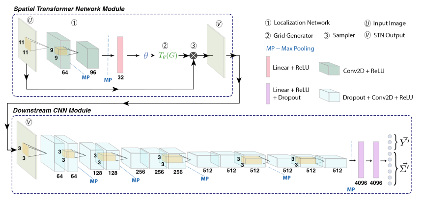
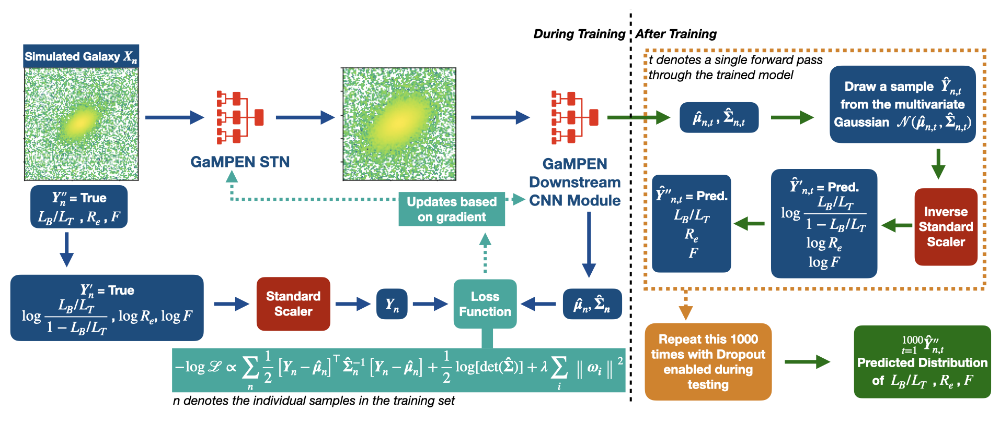
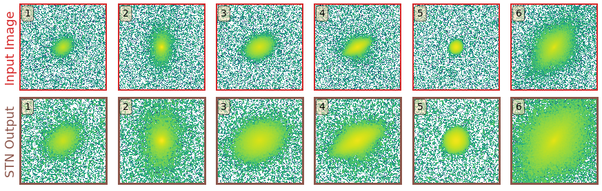

# About GaMPEN

## Why was GaMEPN developed?
Although Convolutional Neural Networks (CNNs) have been used for galaxy morphology determination for quite some time now, a few challenges had persisted. 

Most previously developed CNNs provided broad morphological classifications; and there had been very limited work on estimating structural parameters of galaxies or associated uncertainties using CNN. Even popular non-machine learning tools like Galfit severely underestimate uncertainties by values as high as $\sim75\%$. 

The computation of full Bayesian posteriors for these structural parameters is crucial for drawing scientific inferences that account for uncertainty and are indispensable in the derivation of robust scaling relations or tests of theoretical models using morphology.

One other challenge of using CNNs in astronomy, is the necessity to use fixed cutout sizes. Many practitioners choose to use a large cutout size for which "most galaxies" would remain in the frame. However, this means that typical cutouts contain other galaxies in the frame, often leading to less accurate results. Thus, this becomes a bottleneck when applying CNNs to galaxies over a wide magnitudes or redshifts.

In order to address these above challenges, we developed GaMPEN.

:::{admonition} GaMPEN Feature Summary:-
:class: note

1. GaMPEN estimates posterior distributions for (user-selected) structural parameters of galaxies.

    * GaMPEN's predicted posteriors are **extremely well-calibrated and accurate ($\lesssim 5\%$ derivation)**. They have been shown to be **upto $\sim60\%$ more accurate compared to uncertainties predicted by light-profile fitting algorithms.**

    * GaMPEN takes into account both aleatoric & epistemic uncertainties.

    * GaMPEN incorporates the full covariance matrix in its loss function allowing it to achieve well-calibrated uncertainties for all output parameters.

2. GaMPEN automatically crops input images to an optimal size before determining their morphology.
    *  Due to GaMPEN's design, this step requires no additional training step; except the training to predict structural parameters.
:::

 

## What Parameters and Surveys can GaMPEN be Used for?

The [publicly released GaMPEN models](./Public_data.md) can be easily used for the specific surveys (and magnitude/redshift ranges) on which the models were trained. For example, our [Hyper Suprime-Cam (HSC) models](./Public_data.md#hsc-wide-pdr2-galaxies) can be used to estimate the bulge-to-total light ratio, effective radius, and flux of HSC galaxies till $z < 0.75$.

:::{note}
However, GaMPEN models can be trained from scratch to determine **any combination of parametric and non-parametric structural parameters** (e.g., Sersic Index, Concentration, Asymmetry, etc.) for **any space or ground-based imaging survey**. 
:::

The only catch is that if your data or desired prediction-parameters are different from what we used to train the models, you might have to either fine-tune one of the publicly-released models or train a new model from scratch. We provide a couple of example scenarios below:-

* **Predicting on HSC Data but with Fainter/Higher Redshift Galaxies or Data in a Different Band** -- Start with a publicly-released model that is the closest to your dataset; then fine-tune this model using $\sim \mathcal{O} 10^3$ galaxies with available ground-truth values.

* **Predicting Structural Parameters on HSC Data Not Included in Our Public Release** -- Start with our publicly-released models on real HSC data; discard the last few layers; re-train with ground-truth values for the new structural parameters you want to predict (e.g., Sérsic Index, Concentration, etc.) for  $\sim \mathcal{O} 10^3-10^4$ galaxies.

* **Predicting on Dark Energy Survey Data** -- Start with our publicly-released models on real HSC data (as this will be better than starting from a random initialization); retrain with $\sim \mathcal{O} 10^3-10^4$ real DES galaxies with ``ground-truth" values.

Don't hesitate to contact us if you want our help/advice in training a GaMPEN model for your survey/parameters! 

## More Technical Details About GaMPEN

### GaMPEN's Architecture



GaMPEN's architecture consists of two separate entities:-
 * an upstream Spatial Transformer Network (STN) which enables GaMPEN to automatically crop galaxies to an optimal size;
 * a downstream Convolutional Neural Network (CNN) which enables GaMPEN to predict posterior distributions for various morphological parameters.

GaMPEN's design is based on our previously successful classification CNN, [GaMorNet](https://gamornet.readthedocs.io/en/latest/), as well as as different variants of the Oxford Visual Geometry Group networks. We tried a variety of different architectures before finally converging on this design.

### GaMPEN's Posteriors/Uncertainties


To predict posteriors, GaMMPEN takes into account both aleatoric and epistemic uncertainties. It uses the negative log-likelihood of the output parameters as the loss function combined with the Monte Carlo Dropout technique. GaMPEN also incorporates the full covariance matrix in the loss function, using a series of algebraic manipulations.

The uncertainties/posteriors produced by GaMPEN have been shown to be extremely well-calibrated ( $\lesssim 5\%$ deviation. As shown in [Ghosh et al. 2023](https://arxiv.org/abs/2212.00051) ) this represents a significant improvement over state-of-the-art light profile fitting tools which underestimate uncertainties by $\sim15\%-60\%$ depending on the brightness of the source. 

For a more detailed overview of GaMPEN's uncertainty prediction, we refer to the interested reader to Section 4 and Appendix B of [Ghosh et al. 2022](https://arxiv.org/abs/2207.05107).

### How Does GaMPEN Automatically Crop Galaxies?


In GaMPEN, the Spatial Transformation Network (STN) is upstream of the CNN, where it applies a two-dimensional affine transformation to the input image. Each input image is transformed differently by the STN, which learns the appropriate cropping during the training of the downstream CNN *without additional supervision.*

To perform the transformation the STN predicts the six-parameter matrix of the affine transformation $A_{\theta}$ to be applied to the input image

$$ 
    \left(\begin{array}{c}
    x_{i}^{s} \\
    y_{i}^{s}
    \end{array}\right) = A_{\theta}\left(\begin{array}{c}
    x_{i}^{t} \\
    y_{i}^{t} \\
    1
    \end{array}\right) 
    = \left[\begin{array}{lll}
    \theta_{11} & \theta_{12} & \theta_{13} \\
    \theta_{21} & \theta_{22} & \theta_{23}
    \end{array}\right]\left(\begin{array}{c}
    x_{i}^{t} \\
    y_{i}^{t} \\
    1
    \end{array}\right)
$$

where $ \left(x_i^s,y_i^s\right)$ and $ \left( x_i^t, y_i^t \right) $ are the source and target co-ordinates respectively. As the network trains, the predicted transformation alters slowly based on the loss function (of the downstream task of structural parameter prediction).

Because the transformation we use is differentiable with respect to the parameters, 
gradients can be backpropagated to the predicted parameters $A_{\theta}$. This crucial property allows the STN to be trained using standard backpropagation along with the downstream CNN, without any additional supervision.


### Prediction Stability Against Rotational Transformations


Although CNNs learn to recognize features that are 
invariant under translation -- the learned features are typically not rotationally
invariant. However, this is a problem if CNNs are to be used in astronomy -- especially,
for determining the morphology of galaxies. A CNN should be able to identify the same 
galaxy at two different orientations and return the same values. *But is this true? To what level are the predictions stable?*

The above video shows the stability of predictions by GaMPEN when an input galaxy image
is rotated through various angles. GaMPEN's predictions of all three 
output parameters -- bulge-to-total light ratio ($L_B/L_T$), effective radius ($R_e$),
and flux -- are fairly stable against rotations.


## Publications
GaMPEN was initially introduced in [Ghosh et al. 2022](https://iopscience.iop.org/article/10.3847/1538-4357/ac7f9e) with a companion catalog of Hyper Suprime-Cam Galaxy Structural Parameters in [Ghosh et al. 2023](https://doi.org/10.3847/1538-4357/ac7f9e).

Since then, GaMPEN has been used in other publications. We always try to maintain an updated record of GaMPEN's trained models and associated catalogs [on this page](./Public_data.md).


## Attribution Info.

Please cite the below mentioned publication if you make use of GaMPEN or some code herein.

```tex
   @article{Ghosh2022,
   author = {Aritra Ghosh and C. Megan Urry and Amrit Rau and Laurence Perreault-Levasseur and Miles Cranmer and Kevin Schawinski and Dominic Stark and Chuan Tian and Ryan Ofman and Tonima Tasnim Ananna and Connor Auge and Nico Cappelluti and David B. Sanders and Ezequiel Treister},
   doi = {10.3847/1538-4357/ac7f9e},
   issn = {0004-637X},
   issue = {2},
   journal = {The Astrophysical Journal},
   month = {8},
   pages = {138},
   title = {GaMPEN: A Machine-learning Framework for Estimating Bayesian Posteriors of Galaxy Morphological Parameters},
   volume = {935},
   year = {2022},
   }
```

Additionally, if you are using publicly-released GaMPEN models or catalogs for a specific survey, please cite the relevant publication(s) outlined on [this page](./Public_data.md).


## Getting Help/Contributing

We always welcome contributions to GaMPEN! If you have any questions about using GaMPEN, please feel free to send me an e-mail at this ``aritraghsh09@xxxxx.com`` GMail address.

If you have spotted a bug in the code/documentation or you want to propose a new feature, please feel free to open an issue/a pull request on [GitHub](https://github.com/aritraghsh09/GaMPEN).