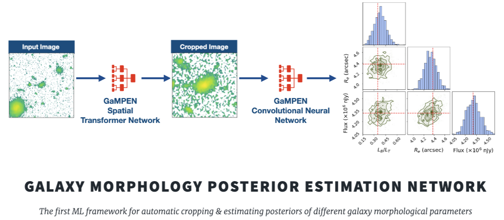

% GaMPEN documentation master file, created by
% sphinx-quickstart on Sat Jun 11 18:37:34 2022.
% You can adapt this file completely to your liking, but it should at least
% contain the root `toctree` directive.

```{toctree}
:maxdepth: 2
:hidden:

self
Getting_Started
Using_GaMPEN
Tutorials
Public_data
```

```{attention}
Note that we are still actively working on the documentation and tutorials of GaMPEN; and the docs are not complete yet. We hope to have the docs fully completed by early January 2023. If you run into issues while trying to use GaMPEN before that, please contact us! We will be happy to help you.
```

# About GaMPEN



***
The Galaxy Morphology Posterior Estimation Network (GaMPEN) is a novel machine learning framework that estimates Bayesian posteriors (i.e., values + uncertainties) of morphological parameters for arbitrarily large numbers of galaxies. GaMPEN also automatically crops input galaxy images to an optimal size before morphological parameter estimation.

## First Steps with GaMPEN
1. Follow the installation instructions and quick-start guide in [Getting Started](./Getting_Started.md).
2. Go through the [Tutorials](./Tutorials.md) to learn how to use GaMPEN for a variety of different tasks.
3. Review the [Using GaMPEN](./Using_GaMPEN.md) page to dive into the details about the various user-facing functions that GaMPEN provides.

We also recommend going through the publications referred to at the bottom of this page. However, for a quick blog-esque introduction to the most important features of GaMPEN, please check out [this page](http://www.astro.yale.edu/aghosh/gampen.html).

Note that if you want to access the publicly released trained models + morphological parameters for the Hyper Suprime-Cam (HSC) survey, please refer to the [Public Data Release Handbook](./Public_data.md) page.


## What Parameters and Surveys can GaMPEN be Used for?

The publicly released GaMPEN models can be used to estimate the bulge-to-total light ratio, effective radius, and flux of galaxies in the Hyper Suprime-Cam (HSC) survey till $z < 0.75$.

**However, GaMPEN models can be trained from scratch to determine any combination of morphological parameters** (even different from the ones mentioned above -- e.g. Sersic Index) **for any space or ground-based imaging survey**. Please check out our [FAQs](./FAQs.md) page for our recommendations if you want to train a GaMPEN model tuned to a specific survey. Also, don't hesitate to contact us if you want our help/advice in training a GaMPEN model for your survey/parameters.

## More Details About GaMPEN

### GaMPEN's Architecture
GaMPEN consists of a two sequential neural networks, a Spatial Transformer Network (STN) followed by a Convolutional Neural Network (CNN). The STN automatically crops input galaxy images to an optimal size before morphological parameter estimation. The CNN then estimates the joint posterior probability distributions of the morphological parameters 


### GaMPEN's Posteriors/Uncertainties
To predict posteriors, GaMMPEN takes into account both aleatoric and epistemic uncertainties. It uses the negative log-likelihood of the output parameters as the loss function combined with the Monte Carlo Dropout technique. GaMPEN also incorporates the full covariance matrix in the loss function, using a series of algebraic manipulations.

The uncertainties/posteriors produced by GaMPEN have been shown to be extremely well-calibrated ($\lesssim 5\%$ deviation)

### Predictional Stabiltily Against Rotational Transformations
The video below shows the stability of predictions made by trained GaMPEN HSC models when an input galaxy image is rotated through various angles. GaMPEN's predictions of all three output parameters are stable against rotations.


## Publication 

GaMPEN was initially introduced in this [ApJ paper](https://iopscience.iop.org/article/10.3847/1538-4357/ac7f9e). 

Since then, GaMPEN has been used in a number of other publications. We always try to maintain an updated record of GaMPEN's trained models and catalogs produced [on this page](http://gampen.ghosharitra.com/)


## Attribution Info.

Please cite the below mentioned publication if you make use of this software module or some code herein.


```tex
   @article{Ghosh2022,
   author = {Aritra Ghosh and C. Megan Urry and Amrit Rau and Laurence Perreault-Levasseur and Miles Cranmer and Kevin Schawinski and Dominic Stark and Chuan Tian and Ryan Ofman and Tonima Tasnim Ananna and Connor Auge and Nico Cappelluti and David B. Sanders and Ezequiel Treister},
   doi = {10.3847/1538-4357/ac7f9e},
   issn = {0004-637X},
   issue = {2},
   journal = {The Astrophysical Journal},
   month = {8},
   pages = {138},
   title = {GaMPEN: A Machine-learning Framework for Estimating Bayesian Posteriors of Galaxy Morphological Parameters},
   volume = {935},
   year = {2022},
   }
```

Additionally, if you are using publicly released GaMPEN models or catalogs for a specific survey, please cite the relevant publication(s) in which the data was released. For example, if you are using the GaMPEN HSC models, please cite [this article](https://arxiv.org/abs/2212.00051).

## License

Copyright 2022 Aritra Ghosh, Amrit Rau & contributors

Made available under a [GNU GPL v3.0](https://github.com/aritraghsh09/GaMPEN/blob/master/LICENSE) license. 


## Getting Help/Contributing

We always welcome contributions to GaMPEN!! If you have any questions about using GaMPEN, please feel free to send me an e-mail at this ``aritraghsh09@xxxxx.com`` GMail address.

If you have spotted a bug in the code/documentation or you want to propose a new feature, please feel free to open an issue/a pull request on [GitHub](https://github.com/aritraghsh09/GaMPEN).


