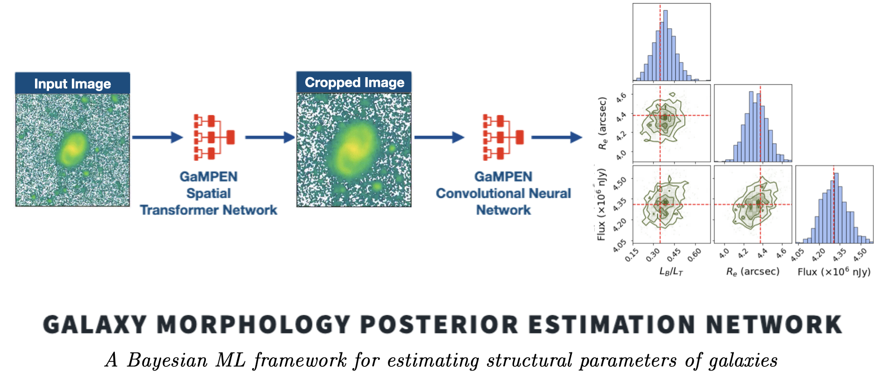

```{toctree}
:maxdepth: 2
:hidden:

self
About_Gampen
Getting_Started
Tutorials
Using_GaMPEN
Public_data
```

# Home

```{attention}
Note that although GaMPEN's current documentation is fairly substantive, we are still working on some parts of the documentation and some Tutorials. If you run into issues while trying to use GaMPEN, please contact us! We will be more than happy to help you!
```



***

The Galaxy Morphology Posterior Estimation Network (GaMPEN) is a Bayesian machine learning framework that can estimate robust posteriors (i.e., values + uncertainties) for structural parameters of galaxies. As the above image shows, GaMPEN also automatically crops input images to an optimal size before structural parameter estimation.

:::{admonition} Feature Highlight
:class:tip

GaMPEN's predicted posteriors are extremely well-calibrated ($<5\%$ deviation) and have been shown to be up to $\sim 60\%$ more accurate compared to the uncertainties predicted by many
light-profile fitting algorithms. 

Once trained, it takes GaMPEN less than a millisecond to perform a single model evaluation on a CPU. Thus, GaMPEN's posterior prediction capabilities are ready for large galaxy samples expected from upcoming large imaging surveys, such as Rubin-LSST, Euclid, and NGRST.
:::


## First Steps with GaMPEN
0. For a quick blog-esque introduction to the most important features of GaMPEN, please check out [this page](http://www.astro.yale.edu/aghosh/gampen.html) and [About GaMPEN](./About_Gampen.md).
:::{tip}
For a deep-dive, please refer to [Ghosh et. al. 2022](https://doi.org/10.3847/1538-4357/ac7f9e) and [Ghosh et. al 2023](https://doi.org/10.3847/1538-4357/acd546).
:::
1. Follow the installation instructions and quick-start guide in [Getting Started](./Getting_Started.md).
2. Go through the [Tutorials](./Tutorials.md) to learn how to use GaMPEN for a variety of different tasks.
3. Review the [Using GaMPEN](./Using_GaMPEN.md) page to dive into the details about the various user-facing functions that GaMPEN provides.

Note that if you want to access the publicly released GaMPEN models or structural parameter catalogs for specific surveys (e.g., Hyper Suprime-Cam), please refer to the [Public Catalogs & Trained Models](./Public_data.md) page.


