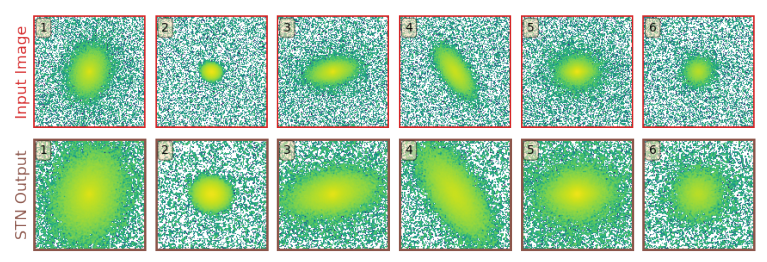

% GaMPEN documentation master file, created by
% sphinx-quickstart on Sat Jun 11 18:37:34 2022.
% You can adapt this file completely to your liking, but it should at least
% contain the root `toctree` directive.

```{toctree}
:caption: 'Contents:'
:maxdepth: 2
:hidden:

self
Getting_Started
Using_GaMPEN
Tutorials
Public_data
```

```{attention}
Note that we are still actively working on the documentation and tutorials of GaMPEN; and the docs are not complete yet. We hope to have the docs fully completed by early Spring 2023. If you run into issues while trying to use GaMPEN before that, please contact us! We will be happy to help you.
```

# About GaMPEN

The **Ga**laxy **M**orphology **P**osterior **E**stimation **N**etwork (GaMPEN) is a novel machine learning framework for estimating the Bayesian posteriors of morphological parameters for arbitrarily large numbers of galaxies. GaMPEN estimates values and uncertainties for a galaxy’s bulge-to-total light
ratio (*L_B/L_T*), effective radius (*R_e*), and flux (*F*). 

GaMPEN uses a CNN module to estimate the joint posterior probability distributions of these parameters. This is done by using the negative log-likelihood of the output parameters as the loss function combined with the Monte Carlo Dropout technique. GaMPEN also incorporates the full covariance matrix in the loss function, using a series of algebraic manipulations. GaMPEN also uses a Spatial Transformer Network (STN) to automatically crop input galaxy frames to an optimal size before determining their morphology which allows it to be applied to new data without prior knowledge of galaxy size.

### Why do we use STN?

Most trained CNNs require input images of a fixed size—thus, most previous works have resorted to selecting a large cutout size for which “most galaxies” would remain in the frame. However, this
means that for many galaxies in the dataset, especially smaller ones, typical cutouts contain other galaxies in the frame, often leading to less accurate results. This problem is aggravated when designing a CNN applicable over an extensive range in redshift, which corresponds to a large range of galaxy sizes. Lastly, most previous work has used computations of Re from previous catalogs to estimate the correct cutout size to choose. This is, of course, not possible when one is trying to use a CNN on a new, unlabeled dataset. 

To address these challenges, GaMPEN automatically crops the input image frames using a Spatial Transformer Network (STN) module upstream of the CNN. The inclusion of the STN in the framework greatly reduces the amount of time spent on data preprocessing as it trains simultaneously with the downstream CNN
without additional supervision. 

### Architecture of GaMPEN

The backbone of GaMPEN is a Convolutional Neural Network. CNNs learn to identify thousands of
local patterns in their input images that are translation invariant. Additionally, CNNs learn the spatial hierarchies of these patterns, allowing them to process increasingly complex and abstract visual concepts. These two key features have allowed deep CNNs to revolutionize the field of image processing in the last decade. 


The architecture of GaMPEN is shown in the above figure. It consists of a Spatial Transformer Network module followed by a downstream CNN module. y. The design of GaMPEN is based on our previously successful classification CNN, GaMorNet (Ghosh et al. 2020), as well as different variants of the VGG networks (Simonyan & Zisserman 2014), which are highly effective at large-scale visual recognition. 

As shown in the above figure, the STN is upstream of the CNN, where it applies a two-dimensional affine transformation to the input image, and the transformed image is then passed to the CNN. Each input image is transformed differently by the STN, which learns the appropriate cropping during the training of the downstream CNN without additional supervision.


In the above figure, the top row shows the input galaxy images, and the bottom row shows the corresponding output from the STN. The numbers in the top-left
yellow boxes help correspond the output images to the input images. As can be seen, the STN learns to apply an optimal amount of cropping for each input galaxy. The STN correctly learns to apply the most aggressive crops to smallest galaxies in our dataset, and the least aggressive crops to the largest galaxies. 

For more details about GaMPEN’s design, how it was trained, etc., please refer to [Publication & Other Data](##Publication%20&%20Other%20Data).

## First contact with GaMPEN

GaMPEN's user-faced functions have been written in a way so that it’s easy to start using them even if you have not dealt with STNs or convolutional neural networks before. For eg. to perform predictions on an array of SDSS images using our trained models, the following line of code is all you need.

```bash
python ggt/train/train.py \
  --experiment_name='ggt-quickstart' \
  --data_dir='data/sdss/' \
  --split_slug='balanced-lg' \
  --expand_data=1 \
  --batch_size=64 \
  --epochs=40 \
  --lr=0.005 \
  --normalize \
  --transform
```

In order to start using GaMPEN, please first look at the Getting Started section for instructions on how to install GaMPEN. Thereafter, we recommend trying out the Tutorials in order to get a handle on how to use GaMPEN.

Finally, you should have a look at the Public Data Release Handbook for our recommendations on how to use different elements of GaMPEN’s public data release for your own work and the API Documentation for detailed documentation of the different functions in the module.

## Publication 

GaMPEN was initially introduced in this [ApJ paper](https://iopscience.iop.org/article/10.3847/1538-4357/ac7f9e) 

An updated record of GaMPEN's trained models and catalogs produced are maintained [here](http://gampen.ghosharitra.com/)


## Attribution Info.

Please cite the above mentioned publication if you make use of this software module or some code herein.


```tex
   @article{Ghosh2022,
   author = {Aritra Ghosh and C. Megan Urry and Amrit Rau and Laurence Perreault-Levasseur and Miles Cranmer and Kevin Schawinski and Dominic Stark and Chuan Tian and Ryan Ofman and Tonima Tasnim Ananna and Connor Auge and Nico Cappelluti and David B. Sanders and Ezequiel Treister},
   doi = {10.3847/1538-4357/ac7f9e},
   issn = {0004-637X},
   issue = {2},
   journal = {The Astrophysical Journal},
   month = {8},
   pages = {138},
   title = {GaMPEN: A Machine-learning Framework for Estimating Bayesian Posteriors of Galaxy Morphological Parameters},
   volume = {935},
   year = {2022},
   }
```

Additionally, if you want, please include the following text in the Software/Acknowledgment section.

```tex
This work uses trained models/software made available as a part of the Galaxy Morphology Posterior Estimation Network public data release.
```

## License

Copyright 2022 Aritra Ghosh, Amrit Rau & contributors

Made available under a [GNU GPL v3.0](https://github.com/aritraghsh09/GaMPEN/blob/master/LICENSE) license. 


## Getting Help/Contributing

If you have a question, please send me an e-mail at this ``aritraghsh09@xxxxx.com`` GMail address.

If you have spotted a bug in the code/documentation or you want to propose a new feature, please feel free to open an issue/a pull request on [GitHub](https://github.com/aritraghsh09/GaMPEN).


